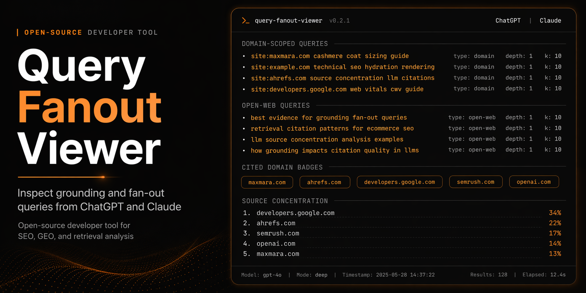
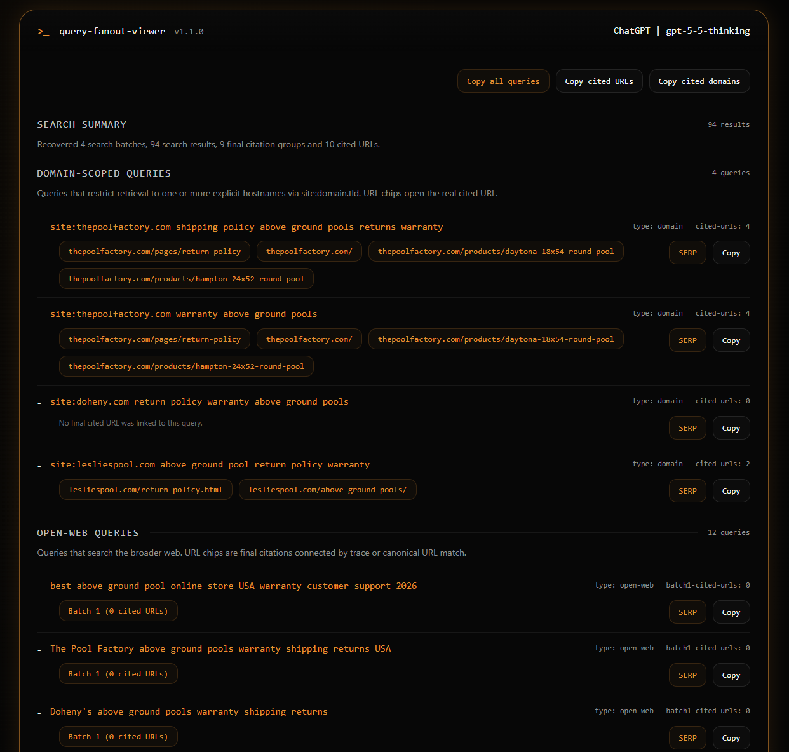
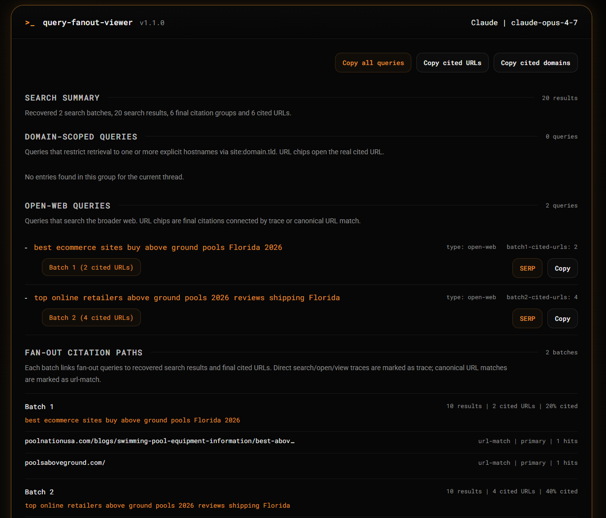

# Query Fanout Viewer

Inspect grounding and fan-out queries from ChatGPT and Claude conversations directly in your browser.

Query Fanout Viewer is a bookmarklet designed for SEO, GEO, retrieval and competitive analysis workflows. It extracts provider-side search prompts, groups them into domain-scoped and open-web queries, and highlights which URLs and domains were actually cited in the final answer.



## Why this exists

LLM outputs hide a lot of useful retrieval behavior.

When you work on SEO, GEO, brand visibility, competitor research or citation analysis, it is often more useful to understand:
- what the model searched
- how broad or narrow the search was
- which retrieved URLs were used as final citations
- which domains survived the retrieval process
- which sources ended up influencing the final response

Query Fanout Viewer turns that hidden layer into something readable.

## Current provider support

- ChatGPT
- Claude

## What it shows

- Grounding / fan-out queries
- Domain-scoped queries
- Open-web queries
- Real cited URLs from the final response
- Query fan-out to citation path analysis
- Search batch, result and final citation correlation
- Cited domains inferred from final cited URLs
- Domain concentration across cited sources
- ChatGPT model slug detection when available
- Provider-aware output for ChatGPT and Claude

## Citation path behavior

Version `1.1` adds a citation path layer on top of the original query and domain view.

For ChatGPT, the viewer reconstructs the path from `web.run` fan-out batches to search results, optional open/view refs and final citation references. Because ChatGPT often runs several queries in the same batch, attribution is strongest at the batch level. Domain-scoped queries still show real cited URL chips inline when the domain match is strong.

For open-web queries, the inline row stays compact: it shows a deep link to the relevant fan-out batch instead of listing every cited URL from that batch. The full URL list remains available in the `Fan-out citation paths` section.

For Claude, the mapping is usually simpler: a `web_search` tool use produces result URLs, and final citations are matched back to those results.

## Screenshots

### ChatGPT


### Claude


## Core use cases

- SEO and GEO audits
- LLM citation tracking
- competitor discovery
- source concentration analysis
- retrieval pattern inspection
- prompt and answer QA
- exploratory research on how models search

## Installation

1. Copy the full bookmarklet code from `src/bookmarklet.js`
2. Create a new browser bookmark
3. Paste the code into the bookmark URL field
4. Open a supported conversation page
5. Run the bookmarklet

Detailed instructions are in [docs/INSTALLATION.md](docs/INSTALLATION.md).

The original `src/bookmarklet.js` is kept as the earlier bookmarklet implementation.

## Privacy

The bookmarklet runs in your browser session and reads provider-side conversation data using same-origin requests.

This repository does not include any server component.

Important notes:
- ChatGPT live mode requires an active logged-in session
- Claude live mode may fail in private browsing depending on session and cookie policy
- the generated viewer uses Google Fonts by default

More details are in [docs/PRIVACY.md](docs/PRIVACY.md).

## Repository structure

```text
src/
  bookmarklet.js Current bookmarklet code with citation path analysis

docs/
  INSTALLATION.md     Setup and usage
  PRIVACY.md          Privacy and security notes

assets/
  screenshots/        Screenshots for README and LinkedIn
```

## Status

Beta.

The bookmarklet is already useful in real analysis workflows, but provider payload formats can change. When they do, parsers may need updates.

## Roadmap

- provider-specific debug panel
- export to CSV
- richer provider detection
- more robust Claude live parsing
- additional provider adapters
- cleaner install/build workflow

## What does not work yet

This project is already useful in real analysis workflows, but some provider paths are still incomplete or unstable.

### Current limitations

- **Claude in private or incognito browsing does not currently work reliably**
  - live session access and provider-side payload retrieval may fail in private browsing mode
  - when this happens, use normal browsing mode or the JSON import fallback

- **Gemini support is not available yet**
  - we are actively studying how to add reliable support
  - if you have insights, payload samples, or reproducible test cases, contributions are welcome

- **Google AI Mode support is not available yet**
  - we are also exploring how to support AI Mode in a robust way
  - research help, technical findings, and parser ideas are very welcome

## Author

Built and maintained by Lorenzo Schiff.

- LinkedIn: https://www.linkedin.com/in/lorenzo-schiff/
- GitHub: https://github.com/LorenzoSchiff

## Contributing

Bug reports, parser fixes, provider-specific improvements and UI polish are welcome.

Read [CONTRIBUTING.md](CONTRIBUTING.md) before opening a pull request.

## Security

If you find a bug that could expose session data or provider responses in an unsafe way, please read [SECURITY.md](SECURITY.md).

## License

MIT. See [LICENSE](LICENSE).
